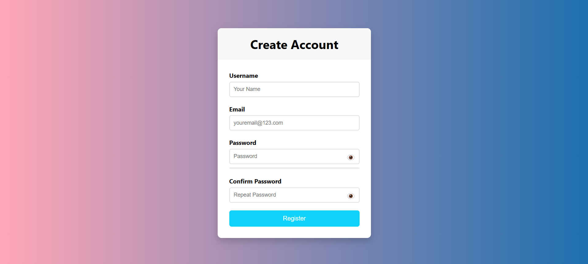

# Form Validation

A sleek and modern form validation project built using HTML, CSS, and JavaScript. It features real-time input validation, password strength checking, show/hide password toggle, and smooth UI animations.

## Features

- ✅ Real-time form validation  
- 🔐 Password strength meter  
- 👁️ Show/hide password toggle  
- ✅ Confirm password matching  
- 🧪 Responsive and animated design  
- ✅ Success message on successful registration  

## Preview

Here’s a quick look at the Form Validation UI:

## 📦 Technologies Used

- HTML5  
- CSS3 (Flexbox + Media Queries)  
- JavaScript (DOM Manipulation + Regex)  

## How to Use

1. Clone or download this repository.  
2. Open `index.html` in your browser.  
3. Fill out the form and watch validations in real-time.  
4. Try entering weak/strong passwords to test the strength meter.

## Customization

- Change background gradients in `style.css`.  
- Modify validation logic in `script.js` as per your rules.  
- Replace success message or add database integration.  

## Future Improvements

- Add dark mode toggle  
- Backend integration (e.g., Firebase, Node.js)  
- Toast notifications  
- Accessibility enhancements (ARIA roles, keyboard navigation)  

## Contributing

Contributions, issues, and feature requests are welcome!  
Feel free to fork this repository and submit a pull request.

## Acknowledgements

- Inspired by modern UI practices and clean UX principles  
- Thanks to open-source contributors and front-end tutorials that shaped this project  

---

Made with ❤️ by [Your Name]
